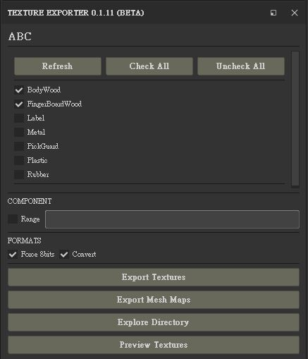

# SurF : Substance Painter Extendsion Tools

## Texture Exporter

Export texture from configuration

### Check The Texture-Sets (Shader Name)

Texture Exporter will list all texture-set in this project.  
Please check the texture-set you want to export,  
If the name was renamed, click "Refresh" could be update the texture-set name.  
"Check All" will check all texture-set, and "Check None" will uncheck all.

#### Legacy Name

Before Substance Painter 2020, the UDIM number is part of texture-set name.  
So if your texture-set name is named as UDIM number such as 1001, 1010, 1020...  
The exporter will make it be legacy name from preset - legacy_name.

### Export Range Definition

Specific channel and range combined by semi-colon, channel name with UDIM range.  
The channel name must is lower-case, range expression can be start-end or single.  
For example, 1001-1010, 1045-1050 or 1010.

#### Invalid UDIM Number

The UDIM number is from 1001 ~ 9999, end number must less than start number.  
For example, 1010-1005 is failed when parsing.

#### Wildcard
The wildcard "*" could be specific all in channel and udim number.  
For example, diffuse:\* is all diffuse's udim would be export,  
\*:1001-1010 is all channel will be export in 1001~1010.

#### Expression Example
- Range : diffuse:1001-1010
- Single: glossiness:1021
- Channel All: normal:*
- All Channel Range: *:1021-1025
- All Channel Single: *:1022

### Formats

* Forec 8bits : If checked, exporter will export all by 8bits, 
otherwise it's bit-depth will due that channel's format.
* Convert : If checked, exporter will convert (TX) after export.
It need convert application such as maketx.

### Functions

* Export Textures : Export textures in this project.
* Export Mesh Maps : Export mesh maps in this project.
* Explore Directory : Open the directory by OS explorer.
* Preview Textures : List all output texture in Log window.

----

### Configuration Setup

The config file is "ExportConfig.json" file.

* configName - This configuration title, for example "ABC".
* python - Python application for convert process, for example "python".
* converter - The converter application path.
* naming - Regular expression for pasing project name,  
Must ends with .spp$ and contains at least 1 group capture.  
That group catpure will be texture's title.
* export_name - Export name specific, can be use substance painter's variable,  
such as $textureSet, $udim..., must defined {0} to replace by title from project.
* legacy_name - If the texture-set name is UDIM, it will use legacy_name for output.
* meshmap_map - The mesh map output name.
* preset - The export preset name.
* export_path - Specific the export sub-folder name.
* convert_path - Specific the convert sub-folder name.
* meshmap_path - Specific the mesh map output sub-folder name.
* export_format - Specific the output format such as "tif", "png", "tga"...
* convert_format - Specific the convert format such as "tx".
* normal_map - Specific the normal map format,  
Texture Exporter always export normal map use converted map,  
"open_gl" (OpenGL) or "direct_x" (DirectX).
* paddingAlgorithm - Specific padding algorithm provided by substance painter.
* output_size - Specific output texture size : 4096,2048,1024,512.
* color_correct - 0 (False) or 1 (True) convert when color-correct,  
color correct just don if texture format is sRGB8.
* dithering : Specific dithering or not provided by substance painter.
* dilationDistance : Specific dilation distance.
* export_shader_params: Specific export shader parameter or not.
* maps: Dictionary channel and output name, you can define custom channel.
* meshmaps: Mesh map output settings.